# 北科大宿舍有線網路攻略(ntut_eastdorm_Ethernet_Guide)
## 第零章	前置作業
在你連上優質又穩定的宿網之前，你必須確認你準備的電腦是否有RJ45網孔(如下[圖 1](./圖檔/圖片1.jpg))以及網路線(如下[圖 2](./圖檔/圖片2.jpg)，建議長度超過3m若使用PC(桌機))，若沒有RJ45網孔，請先購買Type C轉接卡 ，若沒有網路線請先購買網線(購買cat5即可)
| [](./圖檔/圖片1.jpg) | [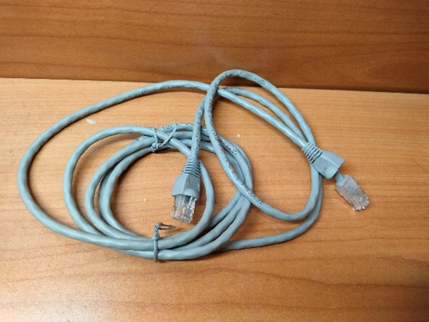](./圖檔/圖片2.jpg) |
| :--: | :--: |
| 圖 1 | 圖 2 |
## 第壹章	網際網路設定
### 方法一：使用圖形化介面(GUI)
#### 步驟1 ：方法一：先找到「設定」
[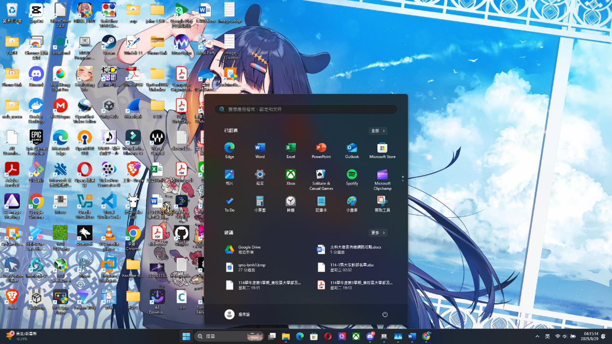](./圖檔/圖片3.png)
#### 步驟2：點選「網路與網際網路」接著再點選「乙太網路」
[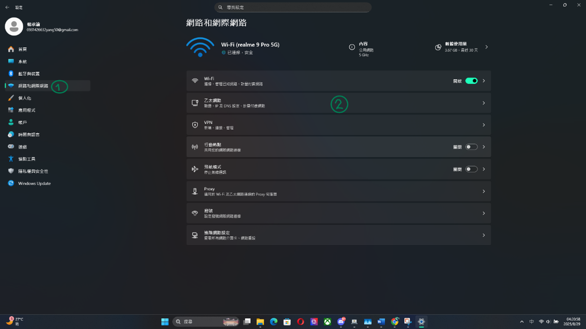](./圖檔/圖片4.png)
#### 步驟3：在「IP指派」點編輯
[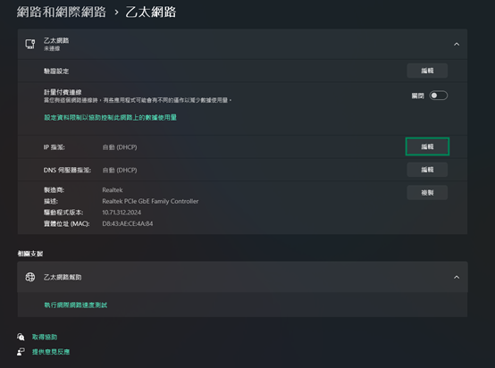](./圖檔/圖片5.png)
#### 步驟4：將編輯IP設定從「自動(DHCP)」切成「手動」
[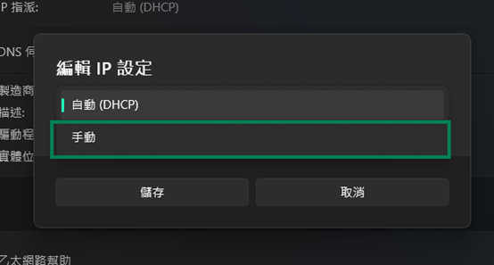](./圖檔/圖片6.png)
#### 步驟5：打開IPv4，IPv6不要開
#### 步驟6：按照下圖設定
[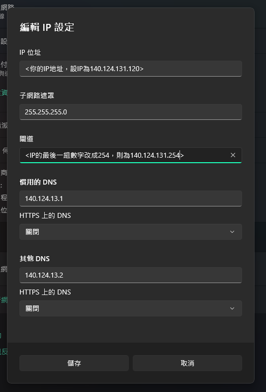](./圖檔/圖片7.png)
### 方法二：使用命令提示字元(CMD)【使用.bat檔自動設定】
#### 步驟1 ：將其複製到記事本
##### 第一種打法
``` shell showLineNumbers
netsh interface ip set address name="乙太網路" static {你的IP位址} 255.255.255.0 {你的IP位址的末碼改成254} 
netsh interface ip set dns name="乙太網路" static 140.124.13.1 
netsh interface ip add dns name="乙太網路" 140.124.13.2 index=2
```
假設IP位址為140.124.131.120則我需要這樣打
``` shell showLineNumbers
netsh interface ip set address name="乙太網路" static 140.124.131.120 255.255.255.0 140.124.131.254 
netsh interface ip set dns name="乙太網路" static 140.124.13.1 
netsh interface ip add dns name="乙太網路" 140.124.13.2 index=2
```
##### 第二種打法(推薦)
``` shell showLineNumbers
@echo off
:: 確保指令路徑正確，避免環境變數問題
SET CMD_NETSH=C:\Windows\System32\netsh.exe
echo [1/3] 正在設定靜態 IP ...
%CMD_NETSH% interface ip set address name="乙太網路" static {你的IP位址} 255.255.255.0 {你的IP位址的末碼改成254}
echo [2/3] 正在設定主要 DNS ...
%CMD_NETSH% interface ip set dns name="乙太網路" static 140.124.13.1
echo [3/3] 正在設定次要 DNS ...
%CMD_NETSH% interface ip add dns name="乙太網路" 140.124.13.2 index=2
echo.
echo 設定完成！檢查結果：
%CMD_NETSH% interface ip show config name="乙太網路"
pause
```
假設IP位址為140.124.131.120則我需要這樣打
``` shell showLineNumbers
@echo off
:: 確保指令路徑正確，避免環境變數問題
SET CMD_NETSH=C:\Windows\System32\netsh.exe
echo [1/3] 正在設定靜態 IP ...
%CMD_NETSH% interface ip set address name="乙太網路" static 140.124.131.120 255.255.255.0 140.124.131.254
echo [2/3] 正在設定主要 DNS ...
%CMD_NETSH% interface ip set dns name="乙太網路" static 140.124.13.1
echo [3/3] 正在設定次要 DNS ...
%CMD_NETSH% interface ip add dns name="乙太網路" 140.124.13.2 index=2
echo.
echo 設定完成！檢查結果：
%CMD_NETSH% interface ip show config name="乙太網路"
pause
```
##### 附錄：使用DHCP(動態分配IP)打法【宿舍不能用】
>只有這個使用UTF-8也沒問題
``` shell showLineNumbers
@echo off
chcp 65001
:: 確保指令路徑正確，避免環境變數問題
SET CMD_NETSH=C:\Windows\System32\netsh.exe
echo [1/2] 正在設定動態 IP ...
netsh interface ip set address name="乙太網路" source=dhcp
echo [2/2] 正在設定動態取得 DNS ...
netsh interface ip set dns name="乙太網路" source=dhcp
echo 已恢復為自動取得 IP。
echo.
echo 設定完成！檢查結果：
%CMD_NETSH% interface ip show config name="乙太網路"
pause
```
#### 步驟2 ：以ANSI編碼方式來儲存檔案
[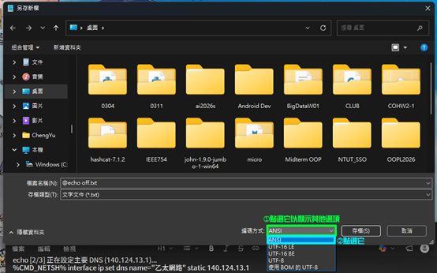](./圖檔/圖片8.png)
#### 步驟3 ：以將副檔名從.txt改成.bat
[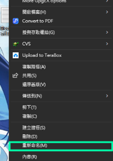](./圖檔/圖片9.png) | [](./圖檔/圖片10.png) | [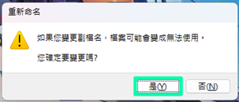](./圖檔/圖片11.png) |
| :--: | :--: | :--: |
| 圖 9 | 圖 10 |  圖 11 |
#### 步驟4 ：以系統管理員身分執行它
[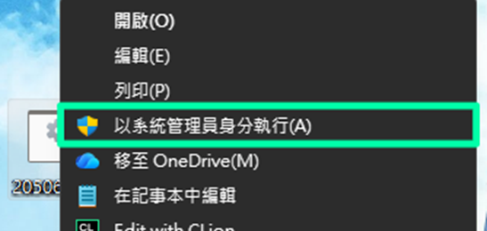](./圖檔/圖片12.png)
#### 步驟5 ：看到CMD視窗一閃而過(第一種打法)或是這個畫面(第二種打法)你就設定好了
[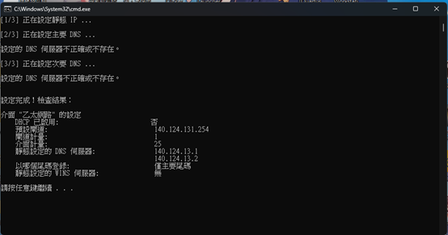](./圖檔/圖片13.png)
## 第貳章	登錄裝置與連結IP
#### 步驟1 ：首先，請先登錄校園入口網站
#### 步驟2 ：點擊「網路管理」，接著點擊網路與資訊安全管理系統
[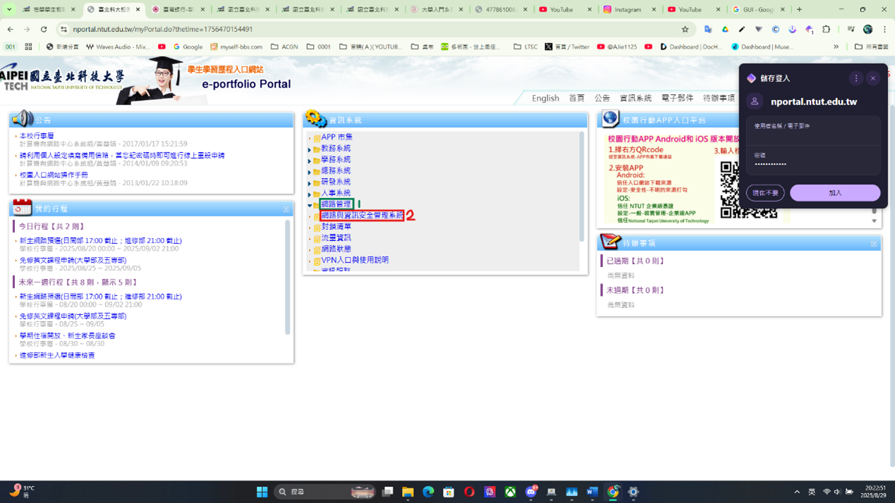](./圖檔/圖片14.png)
#### 步驟3 ：完成點擊之後，自動新開分頁「網路與資訊安全管理系統」
#### 步驟4 ：點擊「IP與MAC」，接著點擊「設備(MAC)管理」
[](./圖檔/圖片15.png)
#### 步驟5 ：點擊「新增」
[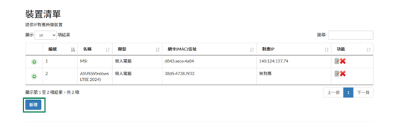](./圖檔/圖片16.png)

> 獲得MAC的方法有兩種
> 1. 使用圖形化介面：
>>回到第一章的乙太網路那一段落(設定>網路與網際網路>乙太網路)，在下方你會看到我們要找的實體位址(MAC)這就是我們要找的東西，把它複製起來
>>
>>[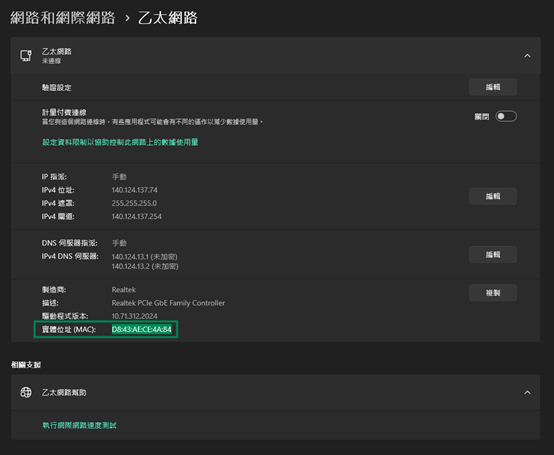](./圖檔/圖片17.png)
>
> 2. 使用命令提示字元(CMD)：
>>輸入
>>
>>```shell
>>getmac /v /fo list
>>```
>>
>>在cmd中找到
>>
>>[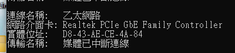](./圖檔/圖片18.png)
>>
>>實體地址即是我們要找的MAC地址

#### 步驟6 ：依照真實情況去做填寫
[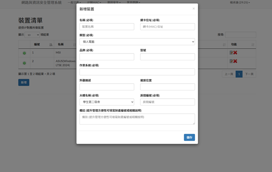](./圖檔/圖片19.png)
#### 步驟7 ：完成後，點擊「IP與MAC」，接著點擊「設備(MAC)管理」
#### 步驟8 ：接著點擊連結符號連結裝置
[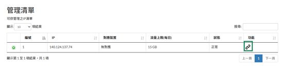](./圖檔/圖片20.png)